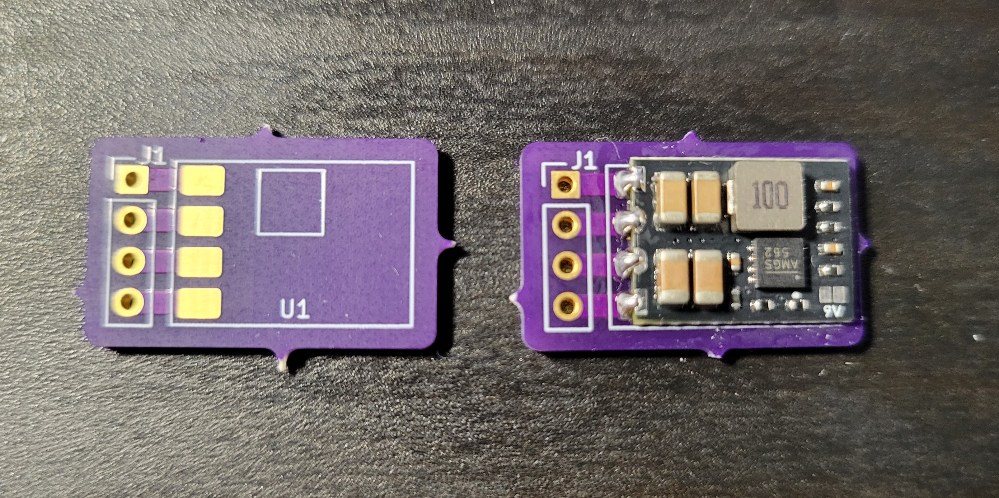
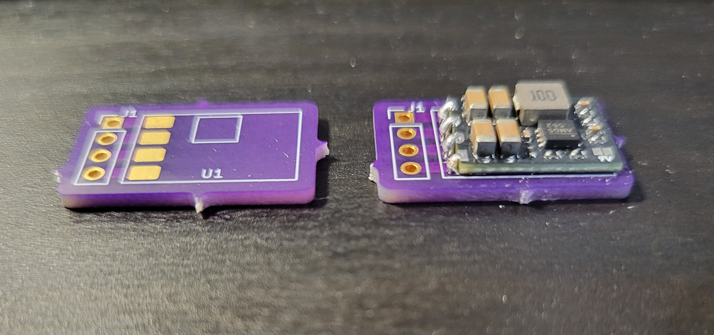

A friend gave me some spare [MatekSys Micro BEC Modules](https://www.mateksys.com/?portfolio=mbec6s) which I thought were handy to have due to their small package. \
However, with the only connection method being the castellated edges, I wasn't able to solder wires or connectors to it easily. \
The product images were also slightly misleading as they use a HASL finish rather then ENIG. This is just a basic breakout PCB that can be used to attach wires or even a 2.54mm XH JST to the board. \
I recommend ordering from OSHPark (as I did) as you can get 3 high-quality PCBs shipped internationally for $2.14 USD. It is cheaper than ordering though JLCPCB/PCBWay.

Images:

